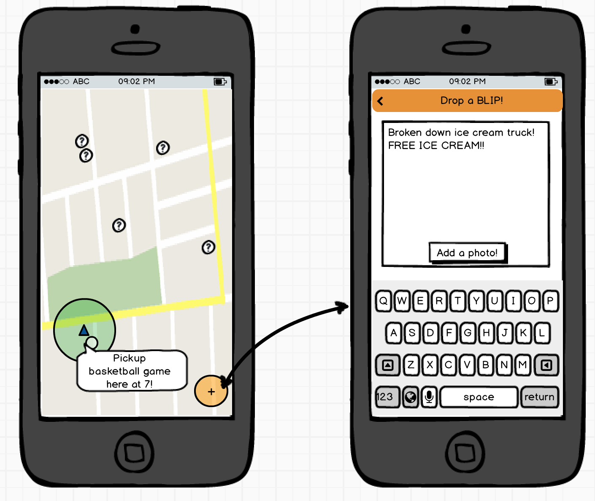

# Blip

Blip is an Android application that allows users to drop Blips for other users to see when they come across the same location. Blips encapsulate information about what the user finds relevant about the location - a fun fact, a personal story, or a general recommendation. Whether the user is a tourist in a new place or a routine commuter, there will always be new blips to stumble across in the city.

* User can create a blip: a small parcel of geo-relevant information, image optional
* User can drop a blip at a lat/long coordinate
* User can view details of a blip within a set radius of any blip that has been dropped
* User can vote visible blips up or down
* Blips will be sorted by net votes

